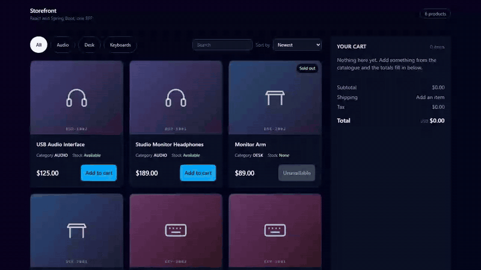

# Spring React Storefront



*Recorded against the local stack: filter, add two items, server-computed totals, sort and search. [Full quality mp4](docs/demo.mp4).*

A small e-commerce catalogue and cart built as a **backend-for-frontend**: a React front end that owns the interface, and a Spring Boot API that shapes payloads specifically for it.

**There is no hosted copy.** The API ran on Render's free tier, and Render has suspended that service, so the Vercel front end no longer has anything to talk to. Everything below runs locally with one Docker command for the database.

It is a portfolio piece with no users and no real customers, so nothing here is claimed as production experience.

## What it does

Browse a catalogue with category filters, name search, whitelisted sorting and pagination; open a product; add to a cart that reserves stock transactionally; step quantities up and down; watch server-computed totals update.

## Stack

| Layer | Choice |
|---|---|
| Front end | React 19, TypeScript, Tailwind CSS 4, TanStack Query |
| API | Java 21, Spring Boot 4.1, Spring MVC, Spring Data JPA, Bean Validation |
| Database | PostgreSQL 17, schema owned by Flyway |
| Tests | JUnit 5 with Testcontainers, MockMvc, Vitest with React Testing Library, Playwright |
| Local infra | Docker Compose |

## Running it

```bash
# 1. Postgres
cd api && docker compose up -d

# 2. API on :8080 (Flyway migrates and seeds on boot)
./mvnw spring-boot:run

# 3. Front end on :5173, proxying /api to :8080
cd ../web && npm install && npm run dev
```

## Verification

Everything below was run, not asserted.

```bash
cd api && ./mvnw test     # 37 passed, against a real Postgres container
cd web && npm test        # 25 passed
cd web && npm run build   # typecheck plus production build
```

A Playwright pass drives the real UI against the real API and checks 14 things,
including that no control escapes a 390px viewport and that the page never
scrolls horizontally.

## Design decisions worth explaining

**Money is an integer count of minor units, never a float.** `priceCents` crosses
the wire as a `long`, and the front end formats it without ever doing arithmetic
on it. Totals, tax and shipping are all computed server side, so a cart total and
a checkout total have no way to disagree.

**Cart lines capture the price at add-to-cart time.** `cart_item.unit_price_cents`
is written when the line is created, so a later catalogue price change cannot
silently re-price a cart a shopper is already looking at.

**The oversell rule lives on the entity.** `Product.reserve(int)` refuses to take
more than `stockQty`, so no service, controller or future caller can oversell by
assigning the field directly. The database carries a matching
`check (stock_qty >= 0)` as the backstop, and `@Version` gives optimistic locking
so two concurrent checkouts cannot both decrement the same row.

**List and detail payloads differ on purpose.** `ProductSummary` has no
`description` component at all, so the card grid cannot ship long text it will
never render. `ProductDetail` adds it. A test asserts the record component is
absent rather than trusting a comment.

**Flyway owns the schema and JPA only validates it.** `ddl-auto=validate` means a
drift between mapping and migration fails at boot instead of at 3am. It earned
its place immediately: it caught `char(3)` in SQL against `varchar(3)` in the
entity on the first run.

**One error envelope.** Every failure returns `{code, message, fieldErrors,
timestamp}`, so the UI branches on `code` and has exactly one thing to render.
Out of stock is a `409`, an unknown sku is a `404`, a bad quantity is a `400`
with the offending field named.

**Validation is duplicated deliberately.** The React form and the
`AddItemRequest` record enforce the same 1..20 rule, because a form is a
convenience and not a boundary.

## The N+1 query, and how it is held down

`Product.category` is `LAZY`. Reading `categorySlug` while mapping a page of
products would therefore fire one extra `SELECT` per distinct category. The
repository query carries `@EntityGraph(attributePaths = "category")` to make it a
single join, and `NoNPlusOneQueryIT` counts the statements Hibernate actually
issued rather than trusting the annotation.

That test is mutation-proven: deleting the `@EntityGraph` takes the count from 2
to 5 and the test fails. Worth noting the shape of the bug, because it is the
reason this needs a counting test at all: it scales with **distinct categories**,
not row count, so the endpoint returns byte-identical JSON either way and stays
fast on a six-row seed while getting slower forever on a real catalogue.

## Interface decisions, and where they came from

The grid and the cart summary were built against real storefronts rather than
guesswork. Product tiles were measured off a live Shopify grid (they are `<li>`
elements inside a real list, carrying no ARIA roles, with the name above an
attribute row and the price sharing the bottom row with the action). The order
summary was read off a real checkout driven with an actual line item.

Two findings changed the build:

- **Every tile shows the same attributes.** Category and stock always render, and
  say `None` rather than disappearing, because tiles that differ from one product
  to the next make products hard to compare. Baymard's product list research
  covers this, and I did not copy any of its figures here.
- **Summary rows never disappear.** The reference kept a Shipping row visible with
  "Enter shipping address" where the number would go. A row that vanishes reads
  worse than one admitting it does not know yet, since surprise shipping or tax is
  a common reason for abandoning a checkout. Here an empty cart still shows all
  four rows at zero.

Stepping a quantity to zero removes the line, which is the documented affordance
rather than hiding removal behind a separate control.

## Layout

```
api/   Spring Boot service, Flyway migrations, Docker Compose for Postgres
web/   Vite React front end
```

## Deployment

The API was deployed on Render as a multi-stage Docker image (Maven builder, JRE
runtime, non-root user) against a managed PostgreSQL 17, with Flyway migrating and
seeding on first boot. It is offline now, as described at the top, because the free
database expired. The front end is on Vercel and takes the API origin from
`VITE_API_BASE`, falling back to same-origin so local development goes through
the Vite proxy and issues no preflight.

CORS is locked to the single front-end origin and verified in both directions:
the real origin receives `access-control-allow-origin`, an unknown origin gets a
`403`. The database had no external IP allowlist, so it was reachable only from
inside the platform.

Two things worth recording, because both passed locally and failed once deployed:

- **Changing an environment variable on Render does not restart the service.** The
  new CORS origin sat unused and preflights kept returning 403 until a deploy was
  triggered. That failure looks exactly like a code fault and is not one.
- **Fixed `waitForTimeout` sleeps encode localhost latency as an assumption.** The
  browser suite passed locally and failed against the deployed instance, where the
  mutation was fine but slower than the guess. Polling the actual condition fixed
  it, and the suite then passed 14/14 against the live site.
